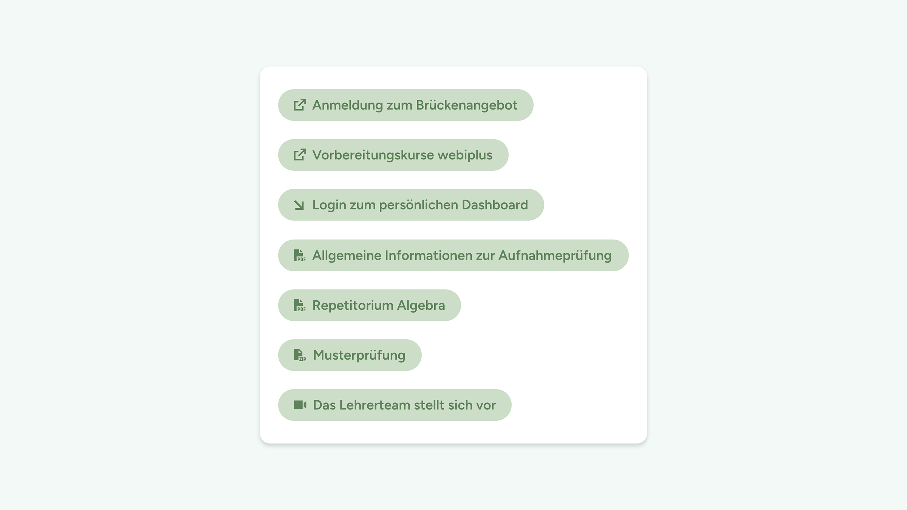

# UD Block: Tag-basierte Links

Dynamischer Block zur Anzeige aller **UD-Link-Blöcke**, die mit bestimmten **Tags** verknüpft sind.
Er ermöglicht es, thematische oder kategoriebasierte Linklisten automatisch zusammenzustellen – ohne doppelte Pflege der Inhalte.

---

## Funktionen

- **Automatische Verknüpfung über Tags**
  - Zeigt alle `ud-link-block`-Instanzen an, die die gewählten Tags besitzen
  - Erkennt auch verschachtelte Link-Blöcke innerhalb von Gruppen, Spalten oder Cover-Blöcken

- **Seitenbezogene Ausgabe**
  - Standardmässig werden die Link-Blöcke der aktuellen Seite verwendet
  - Optional kann eine andere Seite gewählt werden, um deren Link-Blöcke anzuzeigen
  - Ideal für themenspezifische Übersichtsseiten oder Sammlungen

- **Serverseitiges Rendering**
  - Dynamische Ausgabe über `render.php`
  - Änderungen an Link-Blöcken oder Tags werden automatisch übernommen

- **Editor-Integration**
  - Auswahl von Seite und Tags direkt im Block-Editor
  - Getrennte Editor- und Frontend-Skripte für saubere Performance

---

## Frontend- und Editor-Ansicht

*Abbildung: Ansicht im Frontend*

*Abbildung: Ansicht im Editor*

---

## Technische Details

- **Blockname:** `ud/tag-basierte-links`
- **Render-Datei:** `includes/render.php`
- **Attribute:**
  - `selectedPageId` *(integer)* – gewählte Seite
  - `selectedTags` *(array)* – ausgewählte Tags
- **Abhängigkeiten:**
  - Benötigt das Plugin **`ud-link-block`** (liefert die eigentlichen Link-Instanzen)
  - Setzt **`ud-shared-api`** voraus (liefert REST-Endpunkte für Seiten- und Tag-Auswahl)
- **Verarbeitet:**
  - `ud/link-block` (direkt oder verschachtelt in `core/group`, `core/columns`, `core/cover`)

---

## Installation

1. Plugin-Ordner `ud-tagged-links-block` in `wp-content/plugins/` kopieren
2. Im WordPress-Backend unter **Plugins → Installierte Plugins** aktivieren
3. Im Block-Editor den Block **„Tag-basierte Links“** einfügen und konfigurieren

---

## Anforderungen

- WordPress ≥ 6.7
- PHP ≥ 7.4
- Aktivierte UD-Plugins:
  - `ud-link-block`
  - `ud-shared-api`

---

## Autor

**ulrich.digital gmbh**
[https://ulrich.digital](https://ulrich.digital)

---

## Lizenz

GPL v2 or later
[https://www.gnu.org/licenses/gpl-2.0.html](https://www.gnu.org/licenses/gpl-2.0.html)
